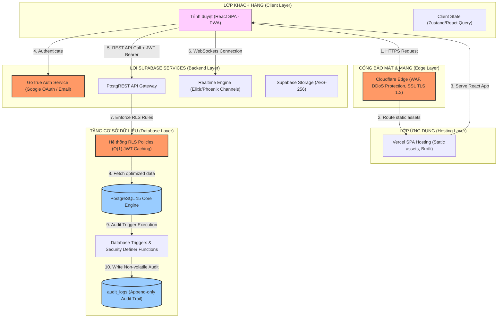
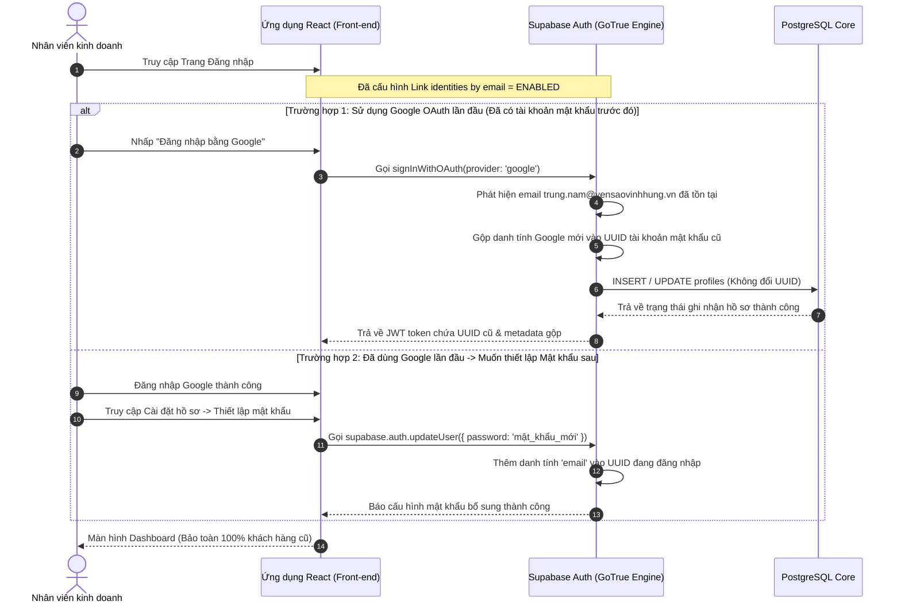
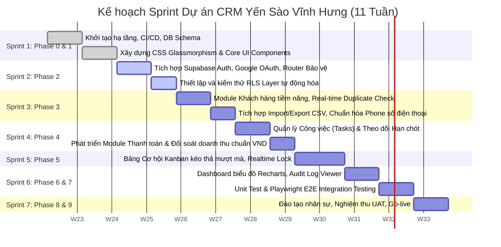

# THIẾT KẾ KIẾN TRÚC & KẾ HOẠCH TRIỂN KHAI HỆ THỐNG (ARCHITECTURAL BLUEPRINT & IMPLEMENTATION PLAN)
## DỰ ÁN: CRM YẾN SÀO VĨNH HƯNG (ENTERPRISE EDITION V2.1)
### Vai trò: Tech Lead / System Architect | Trạng thái: Sẵn sàng Phê duyệt

---

## 📋 MỤC LỤC HỆ THỐNG

1. [Tầm nhìn Hệ thống & Các Chỉ số SLA Mục tiêu (Core SLIs/SLOs)](#1-tầm-nhìn-hệ-thống--các-chỉ-số-sla-mục-tiêu-core-slisslos)
2. [Kiến trúc Tổng thể & Dòng chảy Dữ liệu (System Architecture & Data Flow)](#2-kiến-trúc-tổng-thể--dòng-chảy-dữ-liệu-system-architecture--data-flow)
3. [Cấu trúc Thư mục chuẩn Enterprise & Sơ đồ Tệp tin](#3-cấu-trúc-thư-mục-chuẩn-enterprise--sơ-đồ-tệp-tin)
4. [Mô hình Dữ liệu (Database Schema), Triggers & Ma trận RLS tối ưu O(1)](#4-mô-hình-dữ-liệu-database-schema-triggers--ma-trận-rls-tối-ưu-o1)
5. [Giải pháp Xác thực tích hợp Google OAuth, Đa danh tính & Tránh trùng lặp](#5-giải-pháp-xác-thực-tích-hợp-google-oauth-đa-danh-tính--tránh-trùng-lặp)
6. [Chiến lược Real-time, Offline-first & Anti-abuse](#6-chiến-lược-real-time-offline-first--anti-abuse)
7. [Dependencies Hệ thống & Version Management](#7-dependencies-hệ-thống--version-management)
8. [Lộ trình Phát triển theo Phase & Sơ đồ Sprint Giao việc](#8-lộ-trình-phát-triển-theo-phase--sơ-đồ-sprint-giao-việc)
9. [DevOps, CI/CD Pipeline & Quản lý Schema Migration](#9-devops-cicd-pipeline--quản-lý-schema-migration)
10. [Chiến lược Kiểm thử Toàn diện (Vitest, Integration & Playwright E2E)](#10-chiến-lược-kiểm-thử-toàn-diện-vitest-integration--playwright-e2e)
11. [Giám sát (Sentry, Uptime), Nhật ký Audit Log & Backup / Phục hồi (PITR)](#11-giám-sát-sentry-uptime-nhật-ký-audit-log--backup--phục-hồi-pitr)
12. [Tuân thủ Nghị định 13/2023/NĐ-CP & An toàn Thông tin (AES-256 / Vault)](#12-tuân-thủ-nghị-định-132023nđ-cp--an-toàn-thông-tin-aes-256--vault)
13. [Chiến lược Tối ưu Hiệu năng (Database Indexes, Cache & Bundle Size)](#13-chiến-lược-tối-ưu-hiệu-năng-database-indexes-cache--bundle-size)
14. [Kế hoạch Đào tạo, UAT & Go-live Runbook](#14-kế-hoạch-đào-tạo-uat--go-live-runbook)
15. [Quy chế Phối hợp, Bảo trì & SLA sau Go-live](#15-quy-chế-phối-hợp-bảo-trì--sla-sau-go-live)
16. [Nhật ký Quản lý Rủi ro (Risk Register)](#16-nhật-ký-quản-lý-rủi-ro-risk-register)
17. [Bộ tài liệu Bàn giao đầy đủ (docs/ & Loom Screencasts)](#17-bộ-tài-liệu-bàn-giao-đầy-đủ-docs--loom-screencasts)
18. [Checklist phê duyệt chính thức trước khi code](#18-checklist-phê-duyệt-chính-thức-trước-khi-code)

---

## 1. Tầm nhìn Hệ thống & Các Chỉ số SLA Mục tiêu (Core SLIs/SLOs)

Dự án **CRM Yến Sào Vĩnh Hưng** được thiết kế là một nền tảng vận hành tập trung (CRM Enterprise) phục vụ quy mô **100+ nhân viên hiện tại, khả năng mở rộng 500+ nhân viên** hoạt động đa chi nhánh/đại lý (multi-tenant).

### Các chỉ số SLOs (Service Level Objectives) kỹ thuật cam kết:
*   **Độ sẵn sàng (Uptime)**: $\ge 99.9\%$ đo lường hàng tháng (tương đương tối đa 43 phút downtime/tháng).
*   **Thời gian phản hồi trang đầu (LCP - Largest Contentful Paint)**: $< 1.5\text{s}$ trên đường truyền mạng thông thường.
*   **Tốc độ phản hồi API (Latency p95)**: $< 200\text{ms}$ đối với các truy vấn đọc, $< 500\text{ms}$ đối với các truy vấn ghi dữ liệu.
*   **Tốc độ đồng bộ Real-time trên Kanban**: $< 100\text{ms}$ từ lúc Sales A thực hiện thao tác kéo thẻ đến khi màn hình Sales B cập nhật.
*   **Khả năng phục hồi dữ liệu tối đa**:
    *   **RTO (Recovery Time Objective)**: $\le 2\text{ giờ}$ khi xảy ra thảm họa phần cứng.
    *   **RPO (Recovery Point Objective)**: $\le 1\text{ giờ}$ (bảo toàn dữ liệu nhờ cơ chế Continuous WAL Archiving & PITR).

---

## 2. Kiến trúc Tổng thể & Dòng chảy Dữ liệu (System Architecture & Data Flow)

Hệ thống áp dụng kiến trúc **3-Tier decoupled** kết hợp chặt chẽ cơ chế bảo mật **Zero Trust** từ biên mạng đến lõi cơ sở dữ liệu:



---

## 3. Cấu trúc Thư mục chuẩn Enterprise & Sơ đồ Tệp tin

Mã nguồn được cấu trúc theo mô hình Module hóa nghiêm ngặt của chuẩn React + TypeScript Enterprise. Toàn bộ logic tương tác cơ sở dữ liệu được gom về `/src/lib/supabase/` để dễ quản lý chính sách bảo mật và Unit test.

```text
CRM-VNL-Demo/
├── .github/                       # Quy trình CI/CD tự động
│   └── workflows/
│       ├── ci.yml                 # Lint, Type check, Unit test trên Pull Request
│       ├── deploy-staging.yml     # Deploy tự động Staging khi merge develop
│       └── deploy-production.yml  # Deploy thủ công Production (Manual trigger)
├── docs/                          # Kho tài liệu kỹ thuật & vận hành của dự án (Bàn giao)
│   ├── 01-architecture/           # Thiết kế kiến trúc tổng thể & ADRs
│   ├── 02-database/               # Từ điển dữ liệu, Sơ đồ ERD, RLS policies matrix
│   ├── 03-api/                    # Đặc tả endpoints, cấu trúc payload
│   ├── 04-deployment/             # Hướng dẫn thiết lập môi trường, rollback runbook
│   ├── 05-operations/             # Cẩm nang xử lý sự cố (Runbook), backup & restore
│   ├── 06-user-guides/            # Hướng dẫn sử dụng cho Sales, Kế toán, Admin
│   └── 07-onboarding/             # Hướng dẫn thiết lập môi trường cho nhà phát triển mới
├── supabase/                      # Cấu trúc CSDL (Source-controlled)
│   ├── migrations/                # Tệp tin SQL Migration có số phiên bản (Timestamp)
│   │   ├── 20260517000000_init_enums_tables.sql
│   │   ├── 20260517000001_indexes_optimizations.sql
│   │   ├── 20260517000002_security_definer_functions.sql
│   │   └── 20260517000003_rls_policies_setup.sql
│   ├── seed.sql                   # Dữ liệu hạt giống cho môi trường Dev/Staging
│   └── config.toml                # Cấu hình dự án Supabase CLI
├── src/
│   ├── components/                # React Components chia theo Module nghiệp vụ
│   │   ├── auth/                  # Form đăng nhập Google OAuth, Email/Password, MFA Setup
│   │   ├── dashboard/             # Báo cáo tổng quan, Widget việc nóng trong ngày
│   │   ├── opportunities/         # Bảng Kanban kéo thả (@dnd-kit), Modal quản lý cơ hội
│   │   ├── tasks/                 # Danh sách công việc, bộ theo dõi hạn chót (Deadline tracker)
│   │   ├── customers/             # Bảng quản lý leads, Panel lịch sử tương tác, CSV Handler
│   │   ├── payments/              # Bảng đối soát thanh toán, Modal ghi nhận thanh toán nhanh
│   │   ├── settings/              # Quản lý tài khoản cá nhân, Phân quyền nhân viên, Audit logs viewer
│   │   └── common/                # Hệ thống UI Glassmorphism dùng chung (Premium components)
│   │       ├── GlassCard.tsx      # Lớp kính mờ backdrop-blur-xl
│   │       ├── DataTable.tsx      # Bảng dữ liệu hỗ trợ phân trang & sắp xếp
│   │       ├── Skeleton.tsx       # Loading skeleton mượt mà
│   │       └── ErrorBoundary.tsx  # Bắt lỗi runtime của UI React
│   ├── context/                   # Trạng thái toàn cục (Global States)
│   │   ├── AuthContext.tsx        # Session, Profile, JWT Claims cache
│   │   ├── AppContext.tsx         # Toast Notification, Bộ lọc nhanh toàn cục
│   │   └── OrganizationContext.tsx# Multi-tenant state (Đại lý/Công ty hiện hành)
│   ├── hooks/                     # Custom React Hooks
│   │   ├── useAuth.ts             # Thao tác Auth nhanh
│   │   ├── usePermission.ts       # Kiểm tra vai trò & phân quyền thời gian thực ở UI
│   │   ├── useRealtimeSync.ts     # Đồng bộ Kanban/Khách hàng tự động
│   │   └── useDebounce.ts         # Tránh spam API khi tìm kiếm
│   ├── lib/                       # Thư viện dùng chung
│   │   ├── supabase/              # Nơi duy nhất xử lý database queries
│   │   │   ├── client.ts          # Supabase client singleton
│   │   │   ├── customers.ts       # Logic nghiệp vụ khách hàng
│   │   │   ├── opportunities.ts   # Logic nghiệp vụ cơ hội/Kanban
│   │   │   ├── payments.ts        # Logic đối soát tài chính
│   │   │   └── audit.ts           # Ghi nhận hành động hệ thống
│   │   ├── validators/            # Kiểm tra dữ liệu chuẩn Zod ở Client & Edge
│   │   │   ├── customer.schema.ts
│   │   │   └── payment.schema.ts
│   │   └── utils/                 # Utility helpers
│   │       ├── format.ts          # Định dạng tiền tệ VND chuẩn vi-VN, ngày tháng
│   │       └── phone.ts           # Chuẩn hóa số điện thoại Việt Nam
│   ├── router/                    # Định tuyến bảo vệ đa lớp
│   │   ├── index.tsx              # Cấu hình React Router v6
│   │   └── ProtectedRoute.tsx     # Chặn quyền truy cập URL theo vai trò
│   ├── types/                     # TypeScript Interfaces
│   │   ├── index.ts               # Khai báo dữ liệu nghiệp vụ
│   │   └── supabase.ts            # Tự động đồng bộ từ Database Schema
│   └── index.css                  # Custom Tailwind Glassmorphism CSS class
```

---

## 4. Mô hình Dữ liệu (Database Schema), Triggers & Ma trận RLS tối ưu O(1)

Để đảm bảo tốc độ phản hồi tối ưu khi số lượng bản ghi lên tới hàng trăm ngàn dòng, lõi PostgreSQL 15 được thiết lập tối ưu hóa triệt để.

### 4.1 Cấu hình Enums Hệ thống
```sql
CREATE TYPE user_role AS ENUM ('admin', 'team_lead', 'sales', 'accountant');
CREATE TYPE opportunity_stage_type AS ENUM ('lead', 'contacted', 'proposal', 'negotiation', 'won', 'lost');
CREATE TYPE task_status AS ENUM ('todo', 'in_progress', 'completed', 'overdue');
CREATE TYPE payment_method AS ENUM ('bank_transfer', 'cash', 'cod');
CREATE TYPE payment_status AS ENUM ('pending', 'deposit', 'completed', 'failed');
```

### 4.2 Cấu trúc các bảng nghiệp vụ chính (Dựa trên migrations thực tế)
*   **Bảng `organizations`**: Lưu danh mục chi nhánh, công ty, đại lý thuộc chuỗi Vĩnh Hưng.
*   **Bảng `profiles`**: Bản ghi hồ sơ người dùng mở rộng liên kết $1:1$ với `auth.users`.
*   **Bảng `leads`**: Lưu trữ hồ sơ khách hàng. Cột `assigned_to` liên kết với `profiles.id` để Sales phụ trách.
*   **Bảng `opportunities`**: Lưu trữ các cơ hội kinh doanh hiển thị trên Kanban.
*   **Bảng `audit_logs`**: Nhật ký lưu vết toàn bộ hoạt động CRUD trên toàn hệ thống.

---

### 4.3 Database Triggers & Helper Functions (Security Definer)

Để tránh lỗi đệ quy vòng lặp (recursion) và tối ưu hóa tốc độ thẩm định bảo mật RLS, hệ thống sử dụng cơ chế **JWT App Metadata Caching**.

```sql
-- 1. Helper function trích xuất organization_id từ JWT claim (Độ phức tạp O(1) - Không truy vấn đĩa)
CREATE OR REPLACE FUNCTION get_my_org_id()
RETURNS UUID AS $$
    SELECT COALESCE(
        (auth.jwt() -> 'app_metadata' ->> 'organization_id')::UUID,
        (SELECT organization_id FROM public.profiles WHERE id = auth.uid())
    );
$$ LANGUAGE sql STABLE SECURITY DEFINER SET search_path = public;

-- 2. Helper function trích xuất vai trò từ JWT claim (Độ phức tạp O(1))
CREATE OR REPLACE FUNCTION get_my_role()
RETURNS user_role AS $$
    SELECT COALESCE(
        (auth.jwt() -> 'app_metadata' ->> 'role')::user_role,
        (SELECT role FROM public.profiles WHERE id = auth.uid()),
        'sales'::user_role
    );
$$ LANGUAGE sql STABLE SECURITY DEFINER SET search_path = public;

-- 3. Trigger đồng bộ vai trò & Org ID từ Profiles sang auth.users metadata (Giúp JWT có dữ liệu cache)
CREATE OR REPLACE FUNCTION sync_role_to_auth_metadata()
RETURNS TRIGGER AS $$
BEGIN
    IF NEW.role IS DISTINCT FROM OLD.role OR NEW.organization_id IS DISTINCT FROM OLD.organization_id THEN
        UPDATE auth.users
        SET raw_app_meta_data = 
            COALESCE(raw_app_meta_data, '{}'::jsonb) 
            || jsonb_build_object('role', NEW.role::text, 'organization_id', NEW.organization_id::text)
        WHERE id = NEW.id;
    END IF;
    RETURN NEW;
END;
$$ LANGUAGE plpgsql SECURITY DEFINER;

CREATE OR REPLACE TRIGGER on_profile_role_changed
    AFTER UPDATE OF role, organization_id ON public.profiles
    FOR EACH ROW EXECUTE FUNCTION sync_role_to_auth_metadata();
```

---

### 4.4 Ma trận Row Level Security (RLS) Matrix & Tối ưu hóa truy vấn SQL

Mọi bảng nghiệp vụ mặc định được kích hoạt RLS (`ENABLE ROW LEVEL SECURITY`). Dưới đây là cách triển khai tối ưu hóa RLS Policy trên bảng `leads` để bảo vệ dữ liệu:

```sql
ALTER TABLE public.leads ENABLE ROW LEVEL SECURITY;

-- Policy SELECT dành cho leads: O(1) matching
CREATE POLICY "leads_select_policy" ON public.leads
    FOR SELECT TO authenticated
    USING (
        organization_id = get_my_org_id() -- Phải thuộc cùng chi nhánh/đại lý
        AND (
            get_my_role() = 'admin'::user_role -- Admin xem toàn bộ đại lý của mình
            OR (get_my_role() = 'team_lead'::user_role AND team_id IN (SELECT id FROM teams WHERE lead_id = auth.uid())) -- Trưởng nhóm xem team mình
            OR assigned_to = auth.uid() -- Sales chỉ được xem khách do mình quản lý
        )
    );

-- Policy UPDATE dành cho leads: Ngăn chặn Sales tự chuyển đổi người phụ trách (Re-assign)
CREATE POLICY "leads_update_sales_policy" ON public.leads
    FOR UPDATE TO authenticated
    USING (organization_id = get_my_org_id() AND (assigned_to = auth.uid() OR get_my_role() = 'admin'::user_role))
    WITH CHECK (
        organization_id = get_my_org_id()
        AND (
            get_my_role() = 'admin'::user_role
            OR (get_my_role() = 'sales'::user_role AND assigned_to = auth.uid()) -- Khóa cứng assigned_to không cho Sales tự đổi sang người khác
        )
    );
```

---

## 5. Giải pháp Xác thực tích hợp Google OAuth, Đa danh tính & Tránh trùng lặp

Quy trình xác thực được thiết kế chặt chẽ nhằm tránh trường hợp người dùng đăng ký nhiều tài khoản khác nhau trên cùng một email, gây phân rã dữ liệu và mất lịch sử tương tác.

### 5.1 Sơ đồ luồng gộp tài khoản (Identity Linking Workflow)



---

### 5.2 Ngăn chặn trùng lặp khách hàng (Real-time Lead Duplicate Check)
Để tránh Sales tranh giành hoặc tạo trùng khách hàng tiềm năng, hệ thống tích hợp bộ lọc kép ở mức ứng dụng và ràng buộc cứng ở mức Database:

1.  **Unique Constraint ở Database**:
    ```sql
    ALTER TABLE public.leads ADD CONSTRAINT uq_leads_phone_org 
    UNIQUE (organization_id, phone_primary);
    ```
2.  **Duplicate Check ở UI (Real-time UX)**:
    *   Khi Sales nhập số điện thoại hoặc email trong form `CustomerModal.tsx`, hook `useDebounce` sẽ trì hoãn 500ms sau khi dừng gõ, sau đó kích hoạt API truy vấn nhanh:
    ```typescript
    const checkDuplicateLead = async (phone: string, orgId: string) => {
      const { data, error } = await supabase
        .from('leads')
        .select('id, full_name, assigned_to, profiles(full_name)')
        .eq('organization_id', orgId)
        .eq('phone_primary', phone.trim())
        .maybeSingle();
      
      if (data) {
        return {
          isDuplicate: true,
          leadName: data.full_name,
          assignedSales: data.profiles?.full_name || 'Hệ thống'
        };
      }
      return { isDuplicate: false };
    };
    ```
    *   **UX Cảnh báo**: Nếu phát hiện trùng, hệ thống đổi màu viền ô nhập liệu sang màu vàng kim đậm, hiển thị thông điệp tiếng Việt: *"Số điện thoại này đã được chăm sóc bởi Sales [Tên nhân viên]. Vui lòng không tạo trùng."* và vô hiệu hóa nút "Lưu".

---

## 6. Chiến lược Real-time, Offline-first & Anti-abuse

Nhằm đem lại trải nghiệm cao cấp (WOW UX) đồng thời bảo đảm an toàn tải của hệ thống máy chủ, các tính năng nâng cao sau được áp dụng:

### 6.1 Khóa thẻ Kanban thời gian thực (Pessimistic UI Lock via Realtime Broadcast)
Khi Sales A đang thao tác kéo thả cơ hội kinh doanh trên màn hình, Sales B sẽ nhìn thấy và không thể thao tác đè lên thẻ đó.

```typescript
import { useEffect } from 'react';
import { supabase } from '../lib/supabase/client';

export const useKanbanCardLock = (cardId: string, currentUserId: string, onLockStatusChange: (isLocked: boolean, lockedBy?: string) => void) => {
  useEffect(() => {
    // Khởi tạo kênh Realtime Broadcast
    const kanbanChannel = supabase.channel(`kanban_locks_${cardId}`, {
      config: { broadcast: { self: false } }
    });

    kanbanChannel
      .on('broadcast', { event: 'card_selected' }, (payload) => {
        if (payload.payload.cardId === cardId) {
          onLockStatusChange(true, payload.payload.userName);
        }
      })
      .on('broadcast', { event: 'card_released' }, (payload) => {
        if (payload.payload.cardId === cardId) {
          onLockStatusChange(false);
        }
      })
      .subscribe();

    return () => {
      kanbanChannel.unsubscribe();
    };
  }, [cardId, onLockStatusChange]);
};
```

### 6.2 Chiến lược Ngoại tuyến (Offline-first via React Query Persister)
*   Sử dụng `@tanstack/react-query-persist-client` kết hợp với **IndexedDB** qua `localForage`.
*   Toàn bộ danh sách Khách hàng tiềm năng được lưu trữ cache cục bộ với thời gian hết hạn (`staleTime`) là 10 phút.
*   Khi nhân viên mất mạng (offline), họ vẫn xem được danh sách khách. Khi thêm khách offline, yêu cầu được đẩy vào hàng chờ **Sync Queue** của IndexedDB. Khi phát hiện thiết bị online trở lại, hệ thống tự động đồng bộ tuần tự lên Supabase và đưa ra thông báo thành công dạng toast tiếng Việt.

### 6.3 Chặn đứng tấn công dò quét (Anti-abuse & Bruteforce Protection)
*   **Rate Limiting**: Giới hạn tối đa 30 requests login/15 phút/IP ở tầng Cloudflare và Supabase Auth.
*   **Adaptive hCaptcha**: Khi phát hiện 1 IP đăng nhập sai mật khẩu quá 3 lần liên tiếp, hệ thống kích hoạt hCaptcha buộc người dùng giải mã hình ảnh để tiếp tục.
*   **Bruteforce Lockout**: Tài khoản tự động khóa tạm thời 15 phút nếu nhập sai mật khẩu 5 lần liên tiếp. Hệ thống gửi email cảnh báo đăng nhập bất thường về cho chủ sở hữu tài khoản.

---

## 7. Dependencies Hệ thống & Version Management

Tất cả các thư viện được khóa chặt phiên bản trong `package.json` để tránh lỗi xung đột giữa các nhà phát triển:

```json
{
  "name": "crm-yen-sao-vinh-hung",
  "private": true,
  "version": "2.1.0",
  "type": "module",
  "scripts": {
    "dev": "vite",
    "build": "tsc && vite build",
    "lint": "eslint . --ext ts,tsx --report-unused-disable-directives --max-warnings 0",
    "preview": "vite preview",
    "test": "vitest run",
    "test:watch": "vitest",
    "test:e2e": "playwright test",
    "db:generate-types": "supabase gen types typescript --local > src/types/supabase.ts"
  },
  "dependencies": {
    "@supabase/supabase-js": "^2.43.0",
    "react": "^18.2.0",
    "react-dom": "^18.2.0",
    "react-router-dom": "^6.23.0",
    "recharts": "^2.12.0",
    "papaparse": "^5.4.1",
    "@dnd-kit/core": "^6.1.0",
    "@dnd-kit/sortable": "^8.0.0",
    "@dnd-kit/utilities": "^3.2.2",
    "zod": "^3.23.0",
    "react-hook-form": "^7.51.0",
    "@hookform/resolvers": "^3.3.4",
    "date-fns": "^3.6.0",
    "clsx": "^2.1.0",
    "@sentry/react": "^8.0.0",
    "@tanstack/react-query": "^5.40.0",
    "@tanstack/react-query-persist-client": "^5.40.0",
    "localforage": "^1.10.0"
  },
  "devDependencies": {
    "typescript": "^5.4.0",
    "vite": "^5.2.0",
    "tailwindcss": "^3.4.3",
    "@types/papaparse": "^5.3.14",
    "@types/react": "^18.2.0",
    "@types/react-dom": "^18.2.0",
    "eslint": "^8.57.0",
    "prettier": "^3.2.0",
    "vitest": "^1.6.0",
    "@testing-library/react": "^15.0.0",
    "@playwright/test": "^1.44.0",
    "husky": "^9.0.0",
    "lint-staged": "^15.2.0",
    "supabase": "^1.170.0"
  }
}
```

---

## 8. Lộ trình Phát triển theo Phase & Sơ đồ Sprint Giao việc

Quy trình phát triển Agile/Scrum kéo dài **11 tuần** từ bước khởi tạo đầu tiên đến go-live chính thức:



---

## 9. DevOps, CI/CD Pipeline & Quản lý Schema Migration

Hệ thống được vận hành tự động hóa thông qua nền tảng đám mây GitHub Actions kết hợp Vercel và Supabase CLI.

### 9.1 Ba môi trường độc lập (Three-Tier Environment)
1.  **Development (`dev.crm.yenvinhhung.vn`)**: Kết nối tới Supabase Local/Dev. Nơi test các tính năng mới trước khi đẩy lên.
2.  **Staging (`staging.crm.yenvinhhung.vn`)**: Kết nối tới Supabase Staging. Dữ liệu là bản sao đã được làm sạch của Production. Nơi kiểm thử QA/UAT.
3.  **Production (`crm.yenvinhhung.vn`)**: Hệ thống chạy thực tế cho doanh nghiệp. Bảo mật tối đa.

### 9.2 Chiến lược Quản lý CSDL (Database Migration Strategy)
*   **Tuyệt đối nghiêm cấm** việc bấm nút chỉnh sửa cấu trúc bảng (schema) bằng tay trên giao diện Supabase Dashboard của Production.
*   Mọi thay đổi cấu trúc bảng bắt buộc phải thực hiện thông qua tệp tin migration SQL trong thư mục `/supabase/migrations/` được sinh bởi CLI:
    ```bash
    npx supabase migration new ten_mo_ta_thay_doi
    ```
*   Khi có thay đổi được phê duyệt vào nhánh `main`, hệ thống tự động đẩy Migration lên Production:
    ```bash
    npx supabase db push --linked
    ```

---

## 10. Chiến lược Kiểm thử Toàn diện (Vitest, Integration & Playwright E2E)

Để đảm bảo các quy tắc bảo mật RLS và nghiệp vụ không bao giờ bị hỏng trong quá trình cập nhật mã nguồn (regression), kim tự tháp kiểm thử được áp dụng chặt chẽ:

```text
    ┌─────────────────────────────────────────────────────────┐
    │ 5% E2E TESTS (Playwright)                               │ -> Test 5 luồng cốt lõi trên trình duyệt thật
    ├─────────────────────────────────────────────────────────┤
    │ 15% INTEGRATION TESTS (Supabase DB Check)               │ -> Test RLS, Triggers, Ràng buộc dữ liệu SQL
    ├─────────────────────────────────────────────────────────┤
    │ 80% UNIT TESTS (Vitest + Testing Library)              │ -> Test format, phone, validator, common components
    └─────────────────────────────────────────────────────────┘
```

### Kịch bản Playwright E2E Test tự động tiêu biểu (`/tests/e2e/kanban.spec.ts`):
```typescript
import { test, expect } from '@playwright/test';

test.describe('Kiểm thử luồng Kanban cơ hội kinh doanh', () => {
  test('Đăng nhập và kéo thẻ sang Chốt đơn phải bật Modal Thanh toán', async ({ page }) => {
    // 1. Đăng nhập hệ thống bằng tài khoản Sales test
    await page.goto('/login');
    await page.fill('#email', 'le.sales@yensaovinhhung.vn');
    await page.fill('#password', 'Vinhhung@2026');
    await page.click('button[type="submit"]');
    await expect(page).toHaveURL('/dashboard');

    // 2. Chuyển sang bảng cơ hội Kanban
    await page.goto('/kanban');
    const opportunityCard = page.locator('[data-testid="opp-card-00000006-0000-0000-0000-000000000001"]');
    const wonColumn = page.locator('[data-testid="kanban-column-closed_won"]');

    // 3. Thực hiện thao tác kéo thả card cơ hội sang cột "Chốt đơn"
    await opportunityCard.dragTo(wonColumn);

    // 4. Xác minh hệ thống tự động mở Modal ghi nhận thanh toán nhanh (VND)
    const paymentModal = page.locator('#quick-payment-modal');
    await expect(paymentModal).toBeVisible();
    await expect(page.locator('#amount-input')).toHaveValue('210,000,000');
  });
});
```

---

## 11. Giám sát (Sentry, Uptime), Nhật ký Audit Log & Backup / Phục hồi (PITR)

### 11.1 Giám sát Uptime & Sự cố Runtime (Sentry)
*   Tích hợp **Sentry SDK** ở tầng React UI. Mọi lỗi phát sinh ở trình duyệt của nhân viên bán hàng sẽ tự động nén log và gửi về trung tâm điều khiển Sentry.
*   Cài đặt cảnh báo khẩn cấp qua kênh Slack nội bộ của Tech Lead nếu phát hiện lỗi runtime mới phát sinh ở môi trường Production.
*   Cấu hình **BetterStack Ping** kiểm tra endpoint `/health` của CRM mỗi 60 giây. Nếu hệ thống ngắt kết nối quá 2 phút, tự động gửi tin nhắn SMS cảnh báo cho Đội trực vận hành (On-call Team).

### 11.2 Nhật ký thay đổi (Application Audit Log)
Bảng `audit_logs` là bảng **bất khả xâm phạm (Append-only)**. Hệ thống chỉ cho phép ghi dữ liệu (`INSERT`) và đọc (`SELECT`) đối với tài khoản quản trị viên tối cao (Admin). Tuyệt đối cấm hành động cập nhật (`UPDATE`) hoặc xóa bỏ (`DELETE`).

*   Mỗi hành động thay đổi dữ liệu của leads hay payments đều tự động kích hoạt trigger ghi nhận thay đổi dạng dữ liệu cấu trúc `JSONB`:
    ```json
    {
      "table": "leads",
      "action": "UPDATE",
      "changed_by": "00000003-0000-0000-0000-000000000003",
      "timestamp": "2026-05-17T18:20:00Z",
      "data_diff": {
        "old": { "status": "Đang tư vấn", "value": 280000000 },
        "new": { "status": "Báo giá", "value": 310000000 }
      }
    }
    ```

---

### 11.3 Chiến lược Backup & Disaster Recovery (Phục hồi Thảm họa)
*   **Backup tự động**: Supabase tự động sao lưu toàn vẹn CSDL (Full Database Backup) vào lúc 02:00 ICT hàng ngày và lưu trữ trong vòng 30 ngày.
*   **Point-in-Time Recovery (PITR)**: Kích hoạt ghi nhận Write-Ahead Logging (WAL) liên tục ở gói Supabase Pro Plan, cho phép đội DevOps phục hồi dữ liệu hệ thống trở lại bất kỳ thời điểm nào chuẩn xác đến từng giây trong vòng 7 ngày gần nhất khi xảy ra sự cố phá hoại dữ liệu.
*   **Backup định kỳ thủ công**: Mỗi tối Chủ Nhật, script tự động xuất file SQL CSDL nén mã hóa gửi về lưu trữ tại cụm AWS S3 độc lập bên ngoài Supabase để dự phòng.

---

## 12. Tuân thủ Nghị định 13/2023/NĐ-CP & An toàn Thông tin (AES-256 / Vault)

Là đơn vị quản lý dữ liệu của hơn 10,000 khách hàng mua yến sào cao cấp, hệ thống được thiết lập tuân thủ nghiêm ngặt **Nghị định 13/2023/NĐ-CP về Bảo vệ Dữ liệu Cá nhân (DLCN)**.

### 12.1 Thực thi Quyền chủ thể dữ liệu của Khách hàng
*   **Quyền được xuất dữ liệu**: Admin có tính năng xuất toàn bộ lịch sử chăm sóc, thanh toán, hồ sơ của một khách hàng ra tệp tin JSON được định dạng chuẩn hóa để cung cấp cho khách hàng khi có yêu cầu.
*   **Quyền được xóa dữ liệu (Right to Erasure)**: Hệ thống cung cấp nút "Xóa vĩnh viễn dữ liệu cá nhân" đi kèm yêu cầu nhập lý do. Thao tác này sẽ xóa sạch dữ liệu liên hệ cá nhân (số điện thoại, email, địa chỉ) ở bảng `leads` đồng thời lưu vết lý do xóa vào bảng `audit_logs` để báo cáo thanh tra pháp lý.

### 12.2 Mã hóa dữ liệu tuyệt đối (Data Encryption at Rest & in Transit)
*   **In Transit**: Buộc kết nối HTTPS sử dụng giao thức bảo mật mạng mới nhất **TLS 1.3**.
*   **At Rest**: Dữ liệu ổ đĩa lưu trữ được mã hóa AES-256 mặc định.
*   **Mã hóa cấp ứng dụng (Application-level Encryption)**: Các thông tin cực kỳ nhạy cảm như *Mã số thuế cá nhân, số chứng minh thư, số tài khoản ngân hàng đại lý* được mã hóa trước khi ghi vào ổ đĩa thông qua công nghệ **pgsodium** kết hợp với **Supabase Vault** (Khóa mã hóa lưu ở HSM phần cứng độc lập, Hacker chiếm được DB backup cũng không thể giải mã dữ liệu).

---

## 13. Chiến lược Tối ưu Hiệu năng (Database Indexes, Cache & Bundle Size)

*   **Tối ưu hóa chỉ mục (Indexes)**: Tạo các Partial Indexes cho các bảng để tăng tốc độ quét khi lọc bỏ các dòng đã xóa mềm (`deleted_at IS NULL`):
    ```sql
    CREATE INDEX idx_leads_active_assigned ON public.leads (assigned_to) 
    WHERE (deleted_at IS NULL);
    
    CREATE INDEX idx_leads_phone_search ON public.leads (phone_primary) 
    WHERE (deleted_at IS NULL);
    ```
*   **Tối ưu hóa Bundle Size ở Front-end**:
    *   Sử dụng cơ chế `React.lazy()` kết hợp `Suspense` để tách mã nguồn (code-splitting) theo từng tuyến đường dẫn URL. Người dùng truy cập trang nào chỉ tải mã nguồn của trang đó.
    *   Kích hoạt nén **Brotli** mức độ tối đa trên Vercel CDN giúp giảm dung lượng tệp tin tải ban đầu xuống dưới 200KB.
*   **Tối ưu tải CSDL**: Sử dụng cơ chế cache thông minh của `@tanstack/react-query` giúp tránh việc Sales spam tải lại dữ liệu liên tục khi chuyển đổi qua lại giữa các tab giao diện.

---

## 14. Kế hoạch Đào tạo, UAT & Go-live Runbook

Quy trình chuyển giao phần mềm cho Công ty Yến Sào Vĩnh Hưng được chuẩn hóa thành 3 buổi đào tạo chuyên sâu:

*   **Buổi 1: Dành cho Ban Quản trị (Admin - 4 giờ)**: Hướng dẫn quản trị nhân viên, phân quyền, cấu hình đại lý/chi nhánh, cách trích xuất và đọc Nhật ký Audit log, cấu hình backup và xử lý sự cố.
*   **Buổi 2: Dành cho Trưởng nhóm Sales (Team Lead - 3 giờ)**: Hướng dẫn theo dõi đường ống cơ hội Kanban của nhóm, điều phối leads, thiết lập mục tiêu doanh số và xem báo cáo.
*   **Buổi 3: Dành cho Sales & Kế toán (2 ca, mỗi ca 2 giờ)**: Hướng dẫn thao tác chăm sóc khách hàng hàng ngày, import tệp tin CSV, ghi nhận đơn hàng chốt thành công và làm thanh toán.

### Kịch bản ngày chạy chính thức (Go-live Day - T-0 Runbook):
```text
06:00 ICT: Đội DevOps thực hiện đóng băng dữ liệu (Read-only) hệ thống cũ/Excel cũ.
06:30 ICT: Chạy script migration chuyển đổi dữ liệu từ hệ thống cũ sang Supabase Production.
08:00 ICT: Đội QA thực hiện Smoke test 50 điểm kiểm tra trên hệ thống Production.
08:30 ICT: Mở kết nối chính thức cho toàn bộ 100+ nhân viên.
08:30 - 17:30 ICT: Giai đoạn Hypercare (Đội Tech Lead + BA trực chiến tại văn phòng khách hàng để xử lý ngay lập tức các phát sinh).
```

---

## 15. Quy chế Phối hợp, Bảo trì & SLA sau Go-live

Sau khi bàn giao hệ thống, chúng tôi cam kết gói bảo trì miễn phí **3 tháng** xử lý toàn bộ lỗi phát sinh từ mã nguồn kèm theo mức SLA phản hồi sự cố cam kết:

| Mức độ sự cố | Định nghĩa sự cố | Thời gian Phản hồi tối đa | Thời gian Khắc phục tối đa |
|---|---|---|---|
| 🔴 **P1 - Nghiêm trọng** | Toàn bộ CRM bị sập, nhân viên không thể truy cập hoặc dữ liệu bị mất mát | **$\le 30$ phút** | **$\le 4$ giờ** |
| 🟡 **P2 - Cao** | Một tính năng chính bị hỏng (Ví dụ: Không thể import CSV, không kéo được Kanban) | **$\le 2$ giờ** | **$\le 24$ giờ** |
| 🔵 **P3 - Trung bình** | Lỗi hiển thị giao diện, lỗi chính tả, hoặc tính năng phụ không ảnh hưởng hoạt động | **$\le 1$ ngày làm việc** | **$\le 5$ ngày làm việc** |

---

## 16. Nhật ký Quản lý Rủi ro (Risk Register)

Trong quá trình thi công và vận hành, các rủi ro cốt lõi dưới đây được kiểm soát thông qua các biện pháp kỹ thuật tương ứng:

*   **Rủi ro R1: Thay đổi yêu cầu nghiệp vụ giữa chừng (Xác suất: Cao | Tác động: Cao)**: Khống chế bằng quy trình Change Request nghiêm ngặt và chia nhỏ sản phẩm bàn giao theo Sprint 1 tuần để điều chỉnh kịp thời.
*   **Rủi ro R2: Lỗi Migration dữ liệu từ Excel cũ bị sai lệch định dạng (Xác suất: Trung bình | Tác động: Cao)**: Khống chế bằng cách thực hiện chạy thử (Dry run) import tối thiểu 2 lần trên môi trường Staging và đối soát chéo tổng số dòng dữ liệu.
*   **Rủi ro R3: Lỗi cấu hình RLS gây rò rỉ chéo dữ liệu giữa các đại lý (Xác suất: Rất thấp | Tác động: Cực kỳ nguy hiểm)**: Khống chế bằng bộ test integration tự động hóa chạy quét toàn bộ bảng sau mỗi lần Git PR commit lên staging.

---

## 17. Bộ tài liệu Bàn giao đầy đủ (docs/ & Loom Screencasts)

Khi dự án kết thúc, khách hàng sẽ nhận được bộ bàn giao hoàn hảo gồm:
1.  **Mã nguồn hệ thống** trên Git (gồm cả mã nguồn React và tệp tin Migrations Database).
2.  **Bộ tài liệu kỹ thuật 15 mục** nằm trong thư mục `/docs/` của mã nguồn (viết dạng Markdown).
3.  **Tệp ma trận phân quyền RLS** xuất ra dạng Excel.
4.  **Bộ 10 Video hướng dẫn sử dụng (Loom Screencasts)** trực quan dài 3-5 phút thuyết minh bằng tiếng Việt hướng dẫn từng tác vụ cụ thể của nhân viên.

---

## 18. Checklist phê duyệt chính thức trước khi code

> ⚠️ **Yêu cầu phê duyệt**: Kính đề nghị Product Owner xem xét và tích chọn phê duyệt các mục dưới đây để đội ngũ Tech Lead chính thức bấm nút khởi tạo mã nguồn và triển khai **Phase 0 & Sprint 1**:

- [ ] **Đồng ý** bật tính năng liên kết danh tính tự động `Link identities by email` trên Supabase.
- [ ] **Đồng ý** cấu hình bắt buộc xác nhận email (Email Confirmation) đối với tài khoản Sales mới đăng ký bằng mật khẩu.
- [ ] **Đồng ý** bắt buộc cài đặt bảo mật 2 lớp (MFA) đối với tài khoản Admin và Kế toán.
- [ ] **Xác nhận** cấu trúc phân nhóm 4 vai trò mặc định: `admin`, `team_lead`, `sales`, `accountant` là hoàn toàn chính xác.
- [ ] **Xác nhận** triển khai cấu trúc cơ sở dữ liệu đa đại lý/công ty (Multi-tenant) ngay từ Phase 0 để đảm bảo khả năng mở rộng.
- [ ] **Phê duyệt** lộ trình phát triển 11 tuần và bắt đầu Sprint 1 ngay lập tức.

---
*Tài liệu này là phiên bản v2.1 (Enterprise Ready). Mọi thay đổi tiếp theo sẽ được cập nhật và ghi nhận lịch sử tại CHANGELOG.md.*
